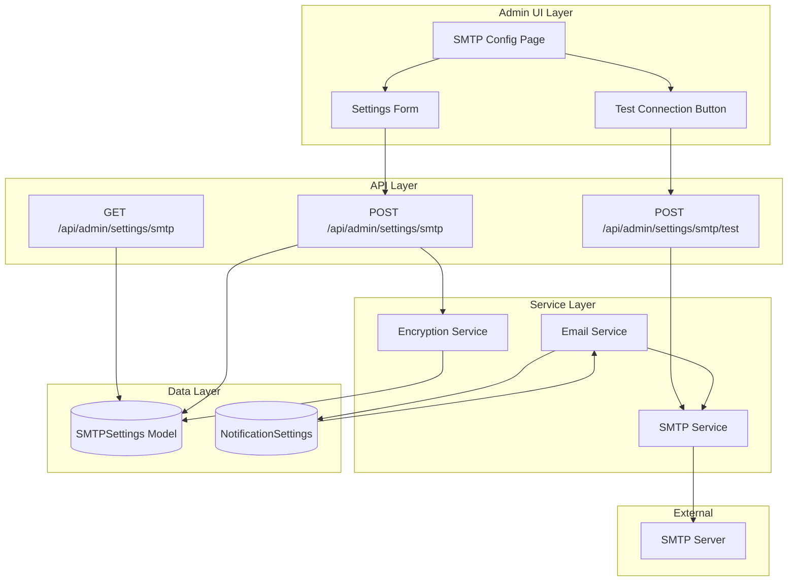
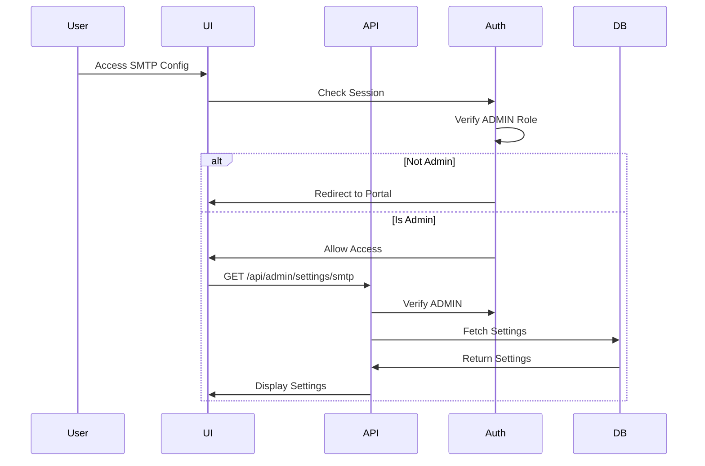
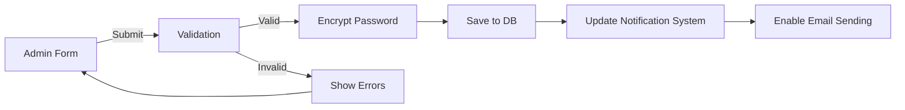

# Design Document: Admin SMTP Configuration

## Overview

This feature adds SMTP (Simple Mail Transfer Protocol) configuration capabilities to the admin section of the PropFirmsTech support portal. The implementation provides a secure, user-friendly interface for administrators to configure email server settings that enable the system to send notifications and emails to users.

### Key Components

1. **Admin UI Page**: A dedicated SMTP configuration page accessible from the admin navigation
2. **Database Model**: Prisma schema extension for storing SMTP settings with encrypted credentials
3. **API Layer**: RESTful endpoints for CRUD operations and connection testing
4. **Email Service**: Nodemailer-based service for sending emails using configured SMTP settings
5. **Integration Layer**: Connection between SMTP configuration and the existing notification system

### Design Goals

- **Security First**: Encrypt sensitive credentials before storage
- **User Experience**: Provide clear feedback, validation, and helpful examples
- **Reliability**: Test connections before saving and provide detailed error messages
- **Integration**: Seamlessly connect with existing notification preferences
- **Maintainability**: Follow established patterns from the existing codebase

## Architecture

### System Architecture



### Authentication Flow

All SMTP configuration endpoints require ADMIN role authentication:



### Data Flow



## Components and Interfaces

### 1. Database Schema Extension

Add a new `SMTPSettings` model to the Prisma schema:

```prisma
model SMTPSettings {
  id              String   @id @default(cuid())
  host            String
  port            Int
  secure          Boolean  @default(true)
  username        String
  password        String   // Encrypted
  senderEmail     String
  senderName      String
  isActive        Boolean  @default(false)
  lastTestedAt    DateTime?
  lastTestSuccess Boolean?
  createdAt       DateTime @default(now())
  updatedAt       DateTime @updatedAt
  createdBy       String
  updatedBy       String
  
  @@map("smtp_settings")
}
```

**Design Decisions**:
- Single row configuration (no multi-tenant SMTP settings in MVP)
- `isActive` flag to enable/disable without deletion
- `lastTestedAt` and `lastTestSuccess` for connection status tracking
- Audit fields (`createdBy`, `updatedBy`) for security logging

### 2. TypeScript Interfaces

```typescript
// lib/types/smtp.ts

export interface SMTPConfig {
  id: string
  host: string
  port: number
  secure: boolean
  username: string
  password: string // Encrypted in DB, decrypted in memory
  senderEmail: string
  senderName: string
  isActive: boolean
  lastTestedAt: Date | null
  lastTestSuccess: boolean | null
  createdAt: Date
  updatedAt: Date
}

export interface SMTPFormData {
  host: string
  port: number
  secure: boolean
  username: string
  password: string // Plain text from form
  senderEmail: string
  senderName: string
}

export interface SMTPTestResult {
  success: boolean
  message: string
  error?: string
  timestamp: Date
}

export interface SMTPConnectionOptions {
  host: string
  port: number
  secure: boolean
  auth: {
    user: string
    pass: string
  }
}
```

### 3. API Endpoints

#### GET /api/admin/settings/smtp

**Purpose**: Retrieve current SMTP configuration

**Authentication**: Requires ADMIN role

**Response**:
```typescript
{
  success: boolean
  data?: SMTPConfig // Password masked
  error?: string
}
```

#### POST /api/admin/settings/smtp

**Purpose**: Create or update SMTP configuration

**Authentication**: Requires ADMIN role

**Request Body**:
```typescript
{
  host: string
  port: number
  secure: boolean
  username: string
  password?: string // Optional on update
  senderEmail: string
  senderName: string
}
```

**Response**:
```typescript
{
  success: boolean
  data?: SMTPConfig
  error?: string
}
```

#### POST /api/admin/settings/smtp/test

**Purpose**: Test SMTP connection and send test email

**Authentication**: Requires ADMIN role

**Request Body**:
```typescript
{
  host: string
  port: number
  secure: boolean
  username: string
  password: string
  senderEmail: string
  senderName: string
}
```

**Response**:
```typescript
{
  success: boolean
  message: string
  error?: string
  timestamp: Date
}
```

### 4. SMTP Service

```typescript
// lib/services/smtp.ts

export class SMTPService {
  /**
   * Create nodemailer transporter from config
   */
  static createTransporter(config: SMTPConnectionOptions): Transporter
  
  /**
   * Test SMTP connection
   */
  static async testConnection(config: SMTPConnectionOptions): Promise<SMTPTestResult>
  
  /**
   * Send test email
   */
  static async sendTestEmail(config: SMTPConnectionOptions, to: string): Promise<SMTPTestResult>
  
  /**
   * Get active SMTP configuration from database
   */
  static async getActiveConfig(): Promise<SMTPConfig | null>
  
  /**
   * Send email using active configuration
   */
  static async sendEmail(options: EmailOptions): Promise<boolean>
}
```

### 5. Encryption Service

```typescript
// lib/services/encryption.ts

export class EncryptionService {
  /**
   * Encrypt sensitive data using AES-256-GCM
   */
  static encrypt(plaintext: string): string
  
  /**
   * Decrypt sensitive data
   */
  static decrypt(ciphertext: string): string
  
  /**
   * Validate encryption key exists
   */
  static validateKey(): boolean
}
```

**Design Decision**: Use AES-256-GCM with a secret key from environment variables (`ENCRYPTION_KEY`). This provides authenticated encryption with associated data (AEAD).

### 6. UI Components

#### SMTP Configuration Page

**Location**: `app/admin/settings/smtp/page.tsx`

**Features**:
- Server-side rendering with session check
- Fetch existing configuration
- Display form with current values
- Show connection status indicator

#### SMTP Settings Form

**Location**: `app/admin/settings/smtp/smtp-settings-form.tsx`

**Features**:
- Client component with form state management
- Real-time validation
- Password field with show/hide toggle
- Test connection button
- Common provider examples (Gmail, Outlook, SendGrid)
- Success/error toast notifications

**Form Fields**:
- SMTP Host (text input)
- SMTP Port (number input, 1-65535)
- Use SSL/TLS (checkbox)
- Username (text input)
- Password (password input with toggle)
- Sender Email (email input)
- Sender Name (text input)

### 7. Navigation Integration

Update `app/admin/modern-admin-nav.tsx` to include SMTP settings:

```typescript
const navItems = [
  { href: '/admin', label: 'Dashboard', icon: '📊', exact: true },
  { href: '/admin/tickets', label: 'Tickets', icon: '🎫' },
  { href: '/admin/companies', label: 'Companies', icon: '🏢' },
  { href: '/admin/users', label: 'Users', icon: '👥' },
  { href: '/admin/settings/smtp', label: 'SMTP Settings', icon: '📧' }, // NEW
]
```

## Data Models

### SMTPSettings Model

| Field | Type | Constraints | Description |
|-------|------|-------------|-------------|
| id | String | Primary Key, CUID | Unique identifier |
| host | String | Required | SMTP server hostname |
| port | Int | Required, 1-65535 | SMTP server port |
| secure | Boolean | Default: true | Use SSL/TLS |
| username | String | Required | SMTP authentication username |
| password | String | Required, Encrypted | SMTP authentication password |
| senderEmail | String | Required, Email format | From email address |
| senderName | String | Required | From display name |
| isActive | Boolean | Default: false | Configuration active status |
| lastTestedAt | DateTime | Nullable | Last connection test timestamp |
| lastTestSuccess | Boolean | Nullable | Last test result |
| createdAt | DateTime | Auto | Creation timestamp |
| updatedAt | DateTime | Auto | Last update timestamp |
| createdBy | String | Required | User ID who created |
| updatedBy | String | Required | User ID who last updated |

### Validation Rules

1. **Host**: Non-empty string, max 255 characters
2. **Port**: Integer between 1 and 65535
3. **Username**: Non-empty string, max 255 characters
4. **Password**: Non-empty string, min 1 character
5. **Sender Email**: Valid email format (RFC 5322)
6. **Sender Name**: Non-empty string, max 255 characters

### Encryption Strategy

- **Algorithm**: AES-256-GCM
- **Key Source**: Environment variable `ENCRYPTION_KEY` (32-byte hex string)
- **IV**: Random 16-byte initialization vector per encryption
- **Storage Format**: `{iv}:{authTag}:{ciphertext}` (hex-encoded)

## Error Handling

### Error Categories

1. **Validation Errors** (400)
   - Invalid email format
   - Port out of range
   - Missing required fields
   - Invalid data types

2. **Authentication Errors** (401)
   - No session
   - Invalid session
   - Non-admin user

3. **Connection Errors** (500)
   - SMTP server unreachable
   - Authentication failed
   - Timeout (10 seconds)
   - SSL/TLS errors

4. **Database Errors** (500)
   - Failed to save settings
   - Failed to retrieve settings
   - Encryption/decryption errors

### Error Response Format

```typescript
{
  success: false,
  error: string, // User-friendly message
  details?: string, // Technical details (dev mode only)
  code?: string // Error code for client handling
}
```

### Error Messages

| Scenario | User Message | HTTP Status |
|----------|--------------|-------------|
| Invalid email | "Please enter a valid email address" | 400 |
| Port out of range | "Port must be between 1 and 65535" | 400 |
| Missing field | "All fields are required" | 400 |
| Not authenticated | "Authentication required" | 401 |
| Not admin | "Admin access required" | 403 |
| SMTP connection failed | "Could not connect to SMTP server: {reason}" | 500 |
| SMTP auth failed | "SMTP authentication failed. Check username and password" | 500 |
| Timeout | "Connection timeout. Please check host and port" | 500 |
| Database error | "Failed to save settings. Please try again" | 500 |

### Retry Strategy

- **Connection Test**: No automatic retry (user-initiated)
- **Email Sending**: 3 retries with exponential backoff (1s, 2s, 4s)
- **Database Operations**: No retry (fail fast)

## Testing Strategy

This feature involves multiple testing approaches based on the type of functionality:

### Unit Tests

**Purpose**: Test specific functions and components in isolation

**Coverage**:
- Form validation logic (email format, port range, required fields)
- Encryption/decryption functions
- SMTP configuration object creation
- Error message formatting
- UI component rendering

**Examples**:
- Test that invalid email addresses are rejected
- Test that port 0 and port 65536 are rejected
- Test that encryption round-trip preserves data
- Test that password masking works correctly
- Test that form displays validation errors

**Tools**: Jest, React Testing Library

### Integration Tests

**Purpose**: Test API endpoints and database interactions

**Coverage**:
- GET /api/admin/settings/smtp returns settings
- POST /api/admin/settings/smtp saves settings
- POST /api/admin/settings/smtp/test validates connection
- Authentication middleware blocks non-admin users
- Database encryption/decryption workflow

**Examples**:
- Test that admin can retrieve SMTP settings
- Test that non-admin gets 403 error
- Test that settings are encrypted in database
- Test that password is masked in API responses

**Tools**: Jest, Supertest (or Next.js API testing)

### Property-Based Tests

**Purpose**: Test universal properties across many generated inputs

**Applicability Assessment**: 
- ✅ **Email validation**: Universal property across all email strings
- ✅ **Port validation**: Universal property across all integers
- ✅ **Encryption round-trip**: Universal property for all strings
- ❌ **SMTP connection**: External service, not suitable for PBT
- ❌ **Database CRUD**: Simple operations, not suitable for PBT
- ❌ **UI rendering**: Not suitable for PBT

**Library**: fast-check (JavaScript/TypeScript property-based testing)

**Configuration**: Minimum 100 iterations per property test


## Correctness Properties

*A property is a characteristic or behavior that should hold true across all valid executions of a system—essentially, a formal statement about what the system should do. Properties serve as the bridge between human-readable specifications and machine-verifiable correctness guarantees.*

### Property Reflection

After analyzing all acceptance criteria, the following properties were identified as testable with property-based testing. Several redundant properties were consolidated:

**Consolidated Properties**:
- Access control properties (1.3, 1.4, 5.4, 8.4) → Single comprehensive authorization property
- Validation properties (2.2, 2.3, 2.4, 2.6) → Individual properties for each validation rule
- Encryption properties (3.4, 5.1) → Single round-trip encryption property

**Properties Suitable for PBT**:
1. Authorization/access control
2. Host validation
3. Port validation
4. Email format validation
5. Password encryption round-trip
6. Audit logging
7. HTTP status code mapping
8. API response schema consistency

### Property 1: Admin-Only Access Control

*For any* user with a role other than ADMIN, attempting to access SMTP configuration endpoints or pages SHALL result in denial of access (403 Forbidden or redirect to portal).

**Validates: Requirements 1.3, 1.4, 5.4, 8.4**

### Property 2: Host Validation

*For any* string input to the host field, the validation SHALL accept non-empty strings and reject empty strings or strings containing only whitespace.

**Validates: Requirements 2.2**

### Property 3: Port Range Validation

*For any* integer input to the port field, the validation SHALL accept values in the range [1, 65535] and reject all values outside this range (including 0, negative numbers, and values > 65535).

**Validates: Requirements 2.3**

### Property 4: Email Format Validation

*For any* string input to the sender email field, the validation SHALL accept strings matching valid email format (RFC 5322) and reject strings that do not match valid email format.

**Validates: Requirements 2.4**

### Property 5: Password Encryption Round-Trip

*For any* password string, encrypting and then decrypting SHALL produce the original password string, ensuring data integrity through the encryption/decryption cycle.

**Validates: Requirements 3.4, 5.1**

### Property 6: Audit Logging Completeness

*For any* SMTP settings update operation, the system SHALL create an audit log entry containing the timestamp, user ID, and change details.

**Validates: Requirements 5.5**

### Property 7: HTTP Status Code Mapping

*For any* API request scenario (success, validation error, unauthorized, server error), the system SHALL return the appropriate HTTP status code (200 for success, 400 for validation errors, 401/403 for unauthorized, 500 for server errors).

**Validates: Requirements 8.5**

### Property 8: API Response Schema Consistency

*For any* API response from SMTP endpoints, the response SHALL conform to the standard schema containing a `success` boolean field and either a `data` field (on success) or an `error` field (on failure).

**Validates: Requirements 8.6**

### Property 9: Valid Configuration Persistence

*For any* valid SMTP configuration, saving to the database and then retrieving SHALL produce an equivalent configuration (with password remaining encrypted).

**Validates: Requirements 2.5**

## Testing Strategy (Continued)

### Property-Based Test Implementation

**Test Library**: fast-check (npm package)

**Installation**:
```bash
npm install --save-dev fast-check @types/fast-check
```

**Test Configuration**:
- Minimum 100 iterations per property test
- Each test tagged with feature name and property number
- Tag format: `Feature: admin-smtp-config, Property {N}: {description}`

**Example Property Test Structure**:

```typescript
// __tests__/smtp-validation.property.test.ts

import fc from 'fast-check'
import { validatePort, validateEmail, validateHost } from '@/lib/validation/smtp'

describe('Feature: admin-smtp-config - Property-Based Tests', () => {
  
  test('Property 3: Port Range Validation', () => {
    fc.assert(
      fc.property(fc.integer(), (port) => {
        const result = validatePort(port)
        
        if (port >= 1 && port <= 65535) {
          expect(result.valid).toBe(true)
        } else {
          expect(result.valid).toBe(false)
        }
      }),
      { numRuns: 100 }
    )
  })
  
  test('Property 4: Email Format Validation', () => {
    fc.assert(
      fc.property(fc.string(), (email) => {
        const result = validateEmail(email)
        
        // Valid emails should pass
        if (email.match(/^[^\s@]+@[^\s@]+\.[^\s@]+$/)) {
          expect(result.valid).toBe(true)
        }
        // Invalid formats should fail
        if (!email.includes('@') || !email.includes('.')) {
          expect(result.valid).toBe(false)
        }
      }),
      { numRuns: 100 }
    )
  })
  
  test('Property 5: Password Encryption Round-Trip', () => {
    fc.assert(
      fc.property(fc.string({ minLength: 1 }), (password) => {
        const encrypted = EncryptionService.encrypt(password)
        const decrypted = EncryptionService.decrypt(encrypted)
        
        expect(decrypted).toBe(password)
      }),
      { numRuns: 100 }
    )
  })
})
```

### Integration Test Strategy

**Purpose**: Test external SMTP connections and database operations

**Coverage**:
- SMTP connection testing with mock server
- Email sending functionality
- Database CRUD operations
- API endpoint authentication and authorization

**Mock Strategy**:
- Use `nodemailer-mock` for SMTP testing
- Use in-memory database or test database for persistence tests
- Mock external SMTP servers for connection tests

**Example Integration Test**:

```typescript
// __tests__/smtp-connection.integration.test.ts

import { SMTPService } from '@/lib/services/smtp'
import nodemailerMock from 'nodemailer-mock'

describe('SMTP Connection Integration Tests', () => {
  
  test('Requirement 4.2: Test connection with valid settings', async () => {
    const config = {
      host: 'smtp.example.com',
      port: 587,
      secure: false,
      auth: {
        user: 'test@example.com',
        pass: 'password123'
      }
    }
    
    const result = await SMTPService.testConnection(config)
    
    expect(result.success).toBe(true)
    expect(result.message).toContain('Connection successful')
  })
  
  test('Requirement 4.5: Send test email on successful connection', async () => {
    const config = {
      host: 'smtp.example.com',
      port: 587,
      secure: false,
      auth: {
        user: 'test@example.com',
        pass: 'password123'
      }
    }
    
    await SMTPService.sendTestEmail(config, 'test@example.com')
    
    const sentMail = nodemailerMock.mock.getSentMail()
    expect(sentMail).toHaveLength(1)
    expect(sentMail[0].to).toBe('test@example.com')
  })
})
```

### Example-Based Unit Test Strategy

**Purpose**: Test specific scenarios and edge cases

**Coverage**:
- Form field rendering
- Button click handlers
- Success/error message display
- Navigation integration
- Default values
- Reset functionality

**Example Unit Tests**:

```typescript
// __tests__/smtp-form.test.tsx

import { render, screen, fireEvent } from '@testing-library/react'
import SMTPSettingsForm from '@/app/admin/settings/smtp/smtp-settings-form'

describe('SMTP Settings Form Unit Tests', () => {
  
  test('Requirement 2.1: Form displays all required fields', () => {
    render(<SMTPSettingsForm />)
    
    expect(screen.getByLabelText(/SMTP Host/i)).toBeInTheDocument()
    expect(screen.getByLabelText(/Port/i)).toBeInTheDocument()
    expect(screen.getByLabelText(/Username/i)).toBeInTheDocument()
    expect(screen.getByLabelText(/Password/i)).toBeInTheDocument()
    expect(screen.getByLabelText(/Sender Email/i)).toBeInTheDocument()
    expect(screen.getByLabelText(/Sender Name/i)).toBeInTheDocument()
  })
  
  test('Requirement 4.1: Test Connection button exists', () => {
    render(<SMTPSettingsForm />)
    
    expect(screen.getByRole('button', { name: /Test Connection/i })).toBeInTheDocument()
  })
  
  test('Requirement 5.2: Password field shows masked characters', () => {
    render(<SMTPSettingsForm initialData={{ password: 'secret123' }} />)
    
    const passwordInput = screen.getByLabelText(/Password/i)
    expect(passwordInput).toHaveAttribute('type', 'password')
  })
  
  test('Requirement 7.5: Reset button clears all fields', () => {
    render(<SMTPSettingsForm />)
    
    // Fill in fields
    fireEvent.change(screen.getByLabelText(/SMTP Host/i), { target: { value: 'smtp.example.com' } })
    fireEvent.change(screen.getByLabelText(/Port/i), { target: { value: '587' } })
    
    // Click reset
    fireEvent.click(screen.getByRole('button', { name: /Reset/i }))
    
    // Verify fields are cleared
    expect(screen.getByLabelText(/SMTP Host/i)).toHaveValue('')
    expect(screen.getByLabelText(/Port/i)).toHaveValue('')
  })
})
```

### Test Coverage Goals

- **Unit Tests**: 80% code coverage
- **Integration Tests**: All API endpoints and database operations
- **Property Tests**: All 9 identified properties with 100+ iterations each
- **E2E Tests**: Critical user flows (configure SMTP, test connection, send email)

### Continuous Integration

- Run all tests on every pull request
- Block merges if tests fail
- Generate coverage reports
- Run property tests with increased iterations (1000) in CI


## Implementation Details

### Dependencies

**New Dependencies to Add**:

```json
{
  "dependencies": {
    "nodemailer": "^6.9.0",
    "crypto": "built-in"
  },
  "devDependencies": {
    "fast-check": "^3.15.0",
    "@types/fast-check": "^3.15.0",
    "@types/nodemailer": "^6.4.14",
    "nodemailer-mock": "^2.0.0"
  }
}
```

### Environment Variables

Add to `.env.example` and `.env`:

```bash
# SMTP Configuration Encryption
ENCRYPTION_KEY=your-32-byte-hex-string-here

# Optional: Default SMTP settings for development
DEV_SMTP_HOST=localhost
DEV_SMTP_PORT=1025
DEV_SMTP_USER=dev@example.com
DEV_SMTP_PASS=devpassword
```

### File Structure

```
app/
  admin/
    settings/
      smtp/
        page.tsx                    # Server component - SMTP config page
        smtp-settings-form.tsx      # Client component - Form with validation
        smtp-provider-examples.tsx  # Client component - Provider examples
lib/
  services/
    smtp.ts                         # SMTP service with nodemailer
    encryption.ts                   # AES-256-GCM encryption service
  validation/
    smtp.ts                         # Validation functions
  types/
    smtp.ts                         # TypeScript interfaces
app/api/
  admin/
    settings/
      smtp/
        route.ts                    # GET and POST handlers
        test/
          route.ts                  # POST handler for connection test
prisma/
  schema.prisma                     # Add SMTPSettings model
  migrations/
    YYYYMMDDHHMMSS_add_smtp_settings/
      migration.sql                 # Migration file
__tests__/
  smtp-validation.property.test.ts  # Property-based tests
  smtp-connection.integration.test.ts # Integration tests
  smtp-form.test.tsx                # Unit tests
```

### Migration Strategy

1. **Database Migration**:
   ```bash
   npx prisma migrate dev --name add_smtp_settings
   ```

2. **Seed Data** (optional for development):
   ```typescript
   // prisma/seed.ts
   await prisma.sMTPSettings.create({
     data: {
       host: 'localhost',
       port: 1025,
       secure: false,
       username: 'dev@example.com',
       password: encryptedPassword,
       senderEmail: 'noreply@propfirmstech.com',
       senderName: 'PropFirmsTech Support',
       isActive: false,
       createdBy: adminUserId,
       updatedBy: adminUserId,
     }
   })
   ```

3. **Rollback Plan**:
   - Keep previous SMTP settings in backup table
   - Provide admin UI to restore previous configuration
   - Document manual rollback steps

### Security Considerations

1. **Encryption Key Management**:
   - Store `ENCRYPTION_KEY` in environment variables only
   - Never commit encryption key to version control
   - Rotate encryption key periodically (requires re-encryption of all passwords)
   - Use different keys for dev/staging/production

2. **Password Handling**:
   - Never log passwords (plain or encrypted)
   - Clear password from memory after encryption
   - Use HTTPS for all API requests
   - Implement rate limiting on test connection endpoint

3. **Access Control**:
   - Verify ADMIN role on every request
   - Log all access attempts (successful and failed)
   - Implement audit trail for all changes
   - Consider IP whitelisting for SMTP config access

4. **SMTP Connection Security**:
   - Prefer SSL/TLS connections (port 465 or 587 with STARTTLS)
   - Validate SSL certificates
   - Implement connection timeout (10 seconds)
   - Sanitize error messages to avoid information disclosure

### Performance Considerations

1. **Caching**:
   - Cache active SMTP configuration in memory
   - Invalidate cache on configuration update
   - TTL: 5 minutes

2. **Connection Pooling**:
   - Reuse nodemailer transporter instances
   - Pool size: 5 connections
   - Idle timeout: 30 seconds

3. **Async Operations**:
   - Test connection asynchronously with timeout
   - Queue email sending for retry logic
   - Use background jobs for bulk email operations

4. **Database Queries**:
   - Index on `isActive` field for quick lookups
   - Use `findFirst` instead of `findMany` for single config
   - Implement query timeout (5 seconds)

### Monitoring and Observability

1. **Metrics to Track**:
   - SMTP connection test success/failure rate
   - Email sending success/failure rate
   - Average connection test duration
   - Configuration update frequency
   - Failed authentication attempts

2. **Logging**:
   - Log all SMTP configuration changes
   - Log connection test results
   - Log email sending attempts and results
   - Use structured logging (JSON format)

3. **Alerts**:
   - Alert on repeated connection test failures
   - Alert on high email sending failure rate
   - Alert on unauthorized access attempts
   - Alert on encryption/decryption errors

### Deployment Checklist

- [ ] Add `ENCRYPTION_KEY` to production environment variables
- [ ] Run database migration
- [ ] Verify ADMIN role exists in production
- [ ] Test SMTP connection with production email provider
- [ ] Configure monitoring and alerts
- [ ] Update documentation
- [ ] Train administrators on SMTP configuration
- [ ] Set up backup and recovery procedures

## Future Enhancements

### Phase 2 Enhancements

1. **Multi-Provider Support**:
   - Support multiple SMTP configurations
   - Failover to backup SMTP provider
   - Load balancing across providers

2. **Advanced Email Features**:
   - HTML email templates with variables
   - Attachment support
   - Email scheduling
   - Bulk email sending with rate limiting

3. **Enhanced Testing**:
   - Email preview before sending
   - Test email to multiple recipients
   - Connection diagnostics (DNS, firewall, etc.)

4. **Audit and Compliance**:
   - Detailed audit log viewer
   - Export audit logs
   - Compliance reports (GDPR, etc.)

5. **UI Improvements**:
   - Configuration wizard for common providers
   - Import/export configuration
   - Configuration templates
   - Dark mode support

### Integration Opportunities

1. **Notification System Integration**:
   - Automatic email sending on ticket events
   - Customizable email templates per company
   - Email notification preferences per user

2. **Monitoring Integration**:
   - Integration with monitoring tools (Datadog, New Relic)
   - Real-time email delivery status
   - Email bounce handling

3. **Third-Party Services**:
   - Integration with SendGrid, Mailgun, AWS SES
   - OAuth authentication for Gmail, Outlook
   - Email verification services

## Appendix

### Common SMTP Provider Settings

#### Gmail

```
Host: smtp.gmail.com
Port: 587 (TLS) or 465 (SSL)
Secure: true
Username: your-email@gmail.com
Password: App-specific password (not regular password)
```

#### Outlook/Office 365

```
Host: smtp.office365.com
Port: 587
Secure: true (STARTTLS)
Username: your-email@outlook.com
Password: Your account password
```

#### SendGrid

```
Host: smtp.sendgrid.net
Port: 587
Secure: true
Username: apikey
Password: Your SendGrid API key
```

#### AWS SES

```
Host: email-smtp.{region}.amazonaws.com
Port: 587
Secure: true
Username: Your SMTP username
Password: Your SMTP password
```

### Encryption Implementation Details

**Algorithm**: AES-256-GCM (Galois/Counter Mode)

**Key Derivation**: Direct use of 32-byte key from environment variable

**IV Generation**: Random 16-byte IV per encryption operation

**Storage Format**: `{iv}:{authTag}:{ciphertext}` (all hex-encoded)

**Example**:
```typescript
// Encryption
const iv = crypto.randomBytes(16)
const cipher = crypto.createCipheriv('aes-256-gcm', key, iv)
let encrypted = cipher.update(plaintext, 'utf8', 'hex')
encrypted += cipher.final('hex')
const authTag = cipher.getAuthTag().toString('hex')
const stored = `${iv.toString('hex')}:${authTag}:${encrypted}`

// Decryption
const [ivHex, authTagHex, ciphertext] = stored.split(':')
const decipher = crypto.createDecipheriv('aes-256-gcm', key, Buffer.from(ivHex, 'hex'))
decipher.setAuthTag(Buffer.from(authTagHex, 'hex'))
let decrypted = decipher.update(ciphertext, 'hex', 'utf8')
decrypted += decipher.final('utf8')
```

### API Request/Response Examples

#### GET /api/admin/settings/smtp

**Request**:
```http
GET /api/admin/settings/smtp HTTP/1.1
Cookie: next-auth.session-token=...
```

**Response (Success)**:
```json
{
  "success": true,
  "data": {
    "id": "clx123abc",
    "host": "smtp.gmail.com",
    "port": 587,
    "secure": true,
    "username": "support@propfirmstech.com",
    "password": "********",
    "senderEmail": "noreply@propfirmstech.com",
    "senderName": "PropFirmsTech Support",
    "isActive": true,
    "lastTestedAt": "2024-01-15T10:30:00Z",
    "lastTestSuccess": true,
    "createdAt": "2024-01-10T08:00:00Z",
    "updatedAt": "2024-01-15T10:30:00Z"
  }
}
```

**Response (No Configuration)**:
```json
{
  "success": true,
  "data": null
}
```

#### POST /api/admin/settings/smtp

**Request**:
```http
POST /api/admin/settings/smtp HTTP/1.1
Content-Type: application/json
Cookie: next-auth.session-token=...

{
  "host": "smtp.gmail.com",
  "port": 587,
  "secure": true,
  "username": "support@propfirmstech.com",
  "password": "app-specific-password",
  "senderEmail": "noreply@propfirmstech.com",
  "senderName": "PropFirmsTech Support"
}
```

**Response (Success)**:
```json
{
  "success": true,
  "data": {
    "id": "clx123abc",
    "host": "smtp.gmail.com",
    "port": 587,
    "secure": true,
    "username": "support@propfirmstech.com",
    "password": "********",
    "senderEmail": "noreply@propfirmstech.com",
    "senderName": "PropFirmsTech Support",
    "isActive": false,
    "lastTestedAt": null,
    "lastTestSuccess": null,
    "createdAt": "2024-01-15T10:35:00Z",
    "updatedAt": "2024-01-15T10:35:00Z"
  }
}
```

**Response (Validation Error)**:
```json
{
  "success": false,
  "error": "Validation failed",
  "details": {
    "port": "Port must be between 1 and 65535",
    "senderEmail": "Invalid email format"
  }
}
```

#### POST /api/admin/settings/smtp/test

**Request**:
```http
POST /api/admin/settings/smtp/test HTTP/1.1
Content-Type: application/json
Cookie: next-auth.session-token=...

{
  "host": "smtp.gmail.com",
  "port": 587,
  "secure": true,
  "username": "support@propfirmstech.com",
  "password": "app-specific-password",
  "senderEmail": "noreply@propfirmstech.com",
  "senderName": "PropFirmsTech Support"
}
```

**Response (Success)**:
```json
{
  "success": true,
  "message": "Connection successful. Test email sent to noreply@propfirmstech.com",
  "timestamp": "2024-01-15T10:40:00Z"
}
```

**Response (Connection Failed)**:
```json
{
  "success": false,
  "error": "Connection failed",
  "message": "Could not connect to SMTP server: Connection timeout",
  "timestamp": "2024-01-15T10:40:00Z"
}
```

**Response (Authentication Failed)**:
```json
{
  "success": false,
  "error": "Authentication failed",
  "message": "SMTP authentication failed. Please check your username and password",
  "timestamp": "2024-01-15T10:40:00Z"
}
```

### References

- [Nodemailer Documentation](https://nodemailer.com/)
- [RFC 5321 - SMTP Protocol](https://tools.ietf.org/html/rfc5321)
- [RFC 5322 - Email Format](https://tools.ietf.org/html/rfc5322)
- [Node.js Crypto Module](https://nodejs.org/api/crypto.html)
- [AES-GCM Encryption](https://en.wikipedia.org/wiki/Galois/Counter_Mode)
- [fast-check Documentation](https://fast-check.dev/)
- [Next.js API Routes](https://nextjs.org/docs/api-routes/introduction)
- [Prisma Schema Reference](https://www.prisma.io/docs/reference/api-reference/prisma-schema-reference)

