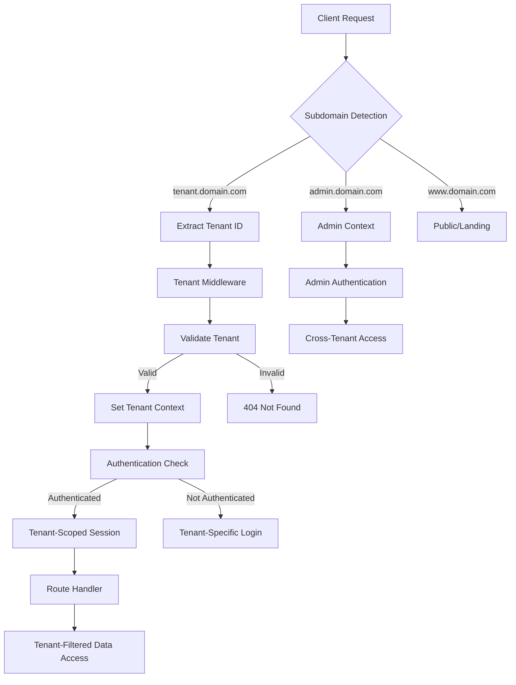

# Design Document

## Overview

The PropFirmsTech Support Portal is a multi-tenant SaaS application that provides isolated support ticketing systems for proprietary trading firms. The system serves two distinct user types: PropFirmsTech internal Admins who manage all tenants, and Client Support Users who belong to specific prop firms with access restricted to their company's data.

### Multi-Tenant Architecture

The portal implements a **shared database, shared application** multi-tenancy model with strict tenant isolation at the data and session layers. Each prop firm client receives a completely isolated experience while sharing the same underlying infrastructure.

**Key Multi-Tenant Features:**
- **Tenant-Isolated Login**: Each prop firm sees only their company during authentication
- **URL-Based Tenant Resolution**: Subdomain routing (`{tenant}.propfirmstech.com`) for clean tenant separation
- **Session Scoping**: All user sessions are scoped to their specific tenant
- **Data Isolation**: Database queries automatically filter by tenant context
- **Admin Cross-Tenant Access**: PropFirmsTech staff can access all tenants via admin interface

### Technology Stack

- **Frontend**: Next.js 14 (App Router), TypeScript, Tailwind CSS
- **Backend**: Next.js API Routes/Server Actions, Prisma ORM
- **Database**: PostgreSQL with tenant-scoped queries
- **Authentication**: NextAuth.js with custom tenant-aware providers
- **File Storage**: Cloud storage service for image attachments
- **Deployment**: Single deployment serving multiple tenants

## Architecture

### Multi-Tenant Request Flow



### System Components

#### 1. Tenant Resolution Layer
- **Subdomain Parser**: Extracts tenant identifier from request URL
- **Tenant Registry**: Maps subdomains to company records
- **Fallback Handling**: Graceful handling of invalid/missing tenants

#### 2. Authentication & Session Management
- **Tenant-Aware Auth**: NextAuth configured with tenant context
- **Session Scoping**: All sessions include tenant information
- **Role-Based Access**: Admin vs Client permissions with tenant boundaries

#### 3. Data Access Layer
- **Tenant Filtering**: Automatic tenant-scoped database queries
- **Admin Override**: Cross-tenant access for PropFirmsTech staff
- **Data Isolation**: Strict separation of tenant data

#### 4. Application Layers
- **Portal Interface**: Client-facing tenant-specific UI
- **Admin Interface**: Cross-tenant management interface
- **Public Interface**: Landing pages and tenant onboarding

## Components and Interfaces

### Core Components

#### TenantResolver
```typescript
interface TenantResolver {
  extractTenantFromRequest(request: Request): string | null
  validateTenant(tenantId: string): Promise<Company | null>
  setTenantContext(tenantId: string): void
}
```

#### TenantMiddleware
```typescript
interface TenantMiddleware {
  resolveTenant(request: NextRequest): Promise<NextResponse>
  handleInvalidTenant(): NextResponse
  redirectToTenantLogin(tenantId: string): NextResponse
}
```

#### AuthService (Enhanced)
```typescript
interface AuthService {
  authenticateWithTenant(
    credentials: LoginCredentials, 
    tenantId: string
  ): Promise<Session | null>
  
  createTenantSession(
    user: User, 
    tenantId: string
  ): Promise<Session>
  
  validateTenantAccess(
    session: Session, 
    requiredTenantId: string
  ): boolean
}
```

#### DataAccessLayer
```typescript
interface TenantScopedRepository<T> {
  findByTenant(tenantId: string, filters?: any): Promise<T[]>
  createForTenant(tenantId: string, data: Partial<T>): Promise<T>
  updateInTenant(tenantId: string, id: string, data: Partial<T>): Promise<T>
  deleteFromTenant(tenantId: string, id: string): Promise<void>
}
```

### API Interfaces

#### Tenant Management API
```typescript
// Admin-only endpoints
POST /api/admin/tenants
GET /api/admin/tenants
PUT /api/admin/tenants/[id]
DELETE /api/admin/tenants/[id]

// Tenant-scoped endpoints
GET /api/portal/tickets (automatically filtered by tenant)
POST /api/portal/tickets (automatically scoped to tenant)
```

#### Authentication API
```typescript
// Tenant-specific login
POST /api/auth/signin/[tenant]
GET /api/auth/session (includes tenant context)
POST /api/auth/signout

// Admin cross-tenant access
POST /api/admin/auth/impersonate/[tenant]
```

### URL Structure

#### Tenant-Specific URLs
- `{tenant}.propfirmstech.com/portal` - Client portal
- `{tenant}.propfirmstech.com/login` - Tenant-specific login
- `{tenant}.propfirmstech.com/api/portal/*` - Tenant-scoped API

#### Admin URLs
- `admin.propfirmstech.com/admin` - Admin dashboard
- `admin.propfirmstech.com/admin/tenants` - Tenant management
- `admin.propfirmstech.com/api/admin/*` - Cross-tenant API

#### Public URLs
- `www.propfirmstech.com` - Landing page
- `propfirmstech.com/signup` - Tenant onboarding

## Data Models

### Enhanced Database Schema

```prisma
model Company {
  id            String   @id @default(cuid())
  name          String
  subdomain     String   @unique // For tenant resolution
  contactEmail  String
  whatsappLink  String?
  notes         String?
  isActive      Boolean  @default(true)
  createdAt     DateTime @default(now())
  updatedAt     DateTime @updatedAt
  
  // Relations
  users         User[]
  tickets       Ticket[]
  
  @@map("companies")
}

model User {
  id        String   @id @default(cuid())
  name      String
  email     String   
  password  String
  role      Role
  companyId String?
  isActive  Boolean  @default(true)
  createdAt DateTime @default(now())
  updatedAt DateTime @updatedAt
  
  // Relations
  company        Company?       @relation(fields: [companyId], references: [id])
  createdTickets Ticket[]       @relation("TicketCreator")
  comments       TicketComment[]
  
  // Composite unique constraint for tenant isolation
  @@unique([email, companyId])
  @@map("users")
}

model Ticket {
  id          String        @id @default(cuid())
  title       String
  description String
  status      TicketStatus  @default(OPEN)
  priority    TicketPriority @default(MEDIUM)
  category    String?
  companyId   String        // Always required for tenant scoping
  createdById String
  createdAt   DateTime      @default(now())
  updatedAt   DateTime      @updatedAt
  
  // Relations
  company     Company         @relation(fields: [companyId], references: [id])
  createdBy   User           @relation("TicketCreator", fields: [createdById], references: [id])
  comments    TicketComment[]
  images      TicketImage[]
  
  @@map("tickets")
}

model TicketComment {
  id        String   @id @default(cuid())
  ticketId  String
  authorId  String
  message   String
  internal  Boolean  @default(false)
  createdAt DateTime @default(now())
  
  // Relations
  ticket    Ticket @relation(fields: [ticketId], references: [id], onDelete: Cascade)
  author    User   @relation(fields: [authorId], references: [id])
  
  @@map("ticket_comments")
}

model TicketImage {
  id       String @id @default(cuid())
  ticketId String
  filename String
  url      String
  size     Int
  mimeType String
  uploadedAt DateTime @default(now())
  
  // Relations
  ticket   Ticket @relation(fields: [ticketId], references: [id], onDelete: Cascade)
  
  @@map("ticket_images")
}

enum Role {
  ADMIN
  CLIENT
}

enum TicketStatus {
  OPEN
  IN_PROGRESS
  WAITING_CLIENT
  RESOLVED
  CLOSED
}

enum TicketPriority {
  LOW
  MEDIUM
  HIGH
  URGENT
}
```

### Tenant Context Model

```typescript
interface TenantContext {
  tenantId: string
  companyId: string
  subdomain: string
  isActive: boolean
}

interface EnhancedSession extends DefaultSession {
  user: {
    id: string
    name: string
    email: string
    role: Role
    companyId?: string
  }
  tenant?: TenantContext
}
```

## Multi-Tenant Security Implementation

### Tenant Isolation Strategies

#### 1. Request-Level Tenant Resolution
```typescript
// middleware.ts
export async function middleware(request: NextRequest) {
  const hostname = request.nextUrl.hostname
  const subdomain = extractSubdomain(hostname)
  
  if (subdomain && subdomain !== 'www' && subdomain !== 'admin') {
    // Validate tenant exists and is active
    const tenant = await validateTenant(subdomain)
    if (!tenant) {
      return new NextResponse('Tenant not found', { status: 404 })
    }
    
    // Set tenant context in headers
    const requestHeaders = new Headers(request.headers)
    requestHeaders.set('x-tenant-id', tenant.id)
    requestHeaders.set('x-tenant-subdomain', subdomain)
    
    return NextResponse.next({
      request: { headers: requestHeaders }
    })
  }
  
  return NextResponse.next()
}
```

#### 2. Database Query Scoping
```typescript
// lib/tenant-db.ts
export class TenantScopedPrisma {
  constructor(private prisma: PrismaClient, private tenantId: string) {}
  
  get tickets() {
    return {
      findMany: (args?: any) => this.prisma.ticket.findMany({
        ...args,
        where: { ...args?.where, companyId: this.tenantId }
      }),
      
      create: (args: any) => this.prisma.ticket.create({
        ...args,
        data: { ...args.data, companyId: this.tenantId }
      }),
      
      // Other methods automatically scoped...
    }
  }
}
```

#### 3. Session Validation
```typescript
// lib/auth-helpers.ts
export async function requireTenantAccess(
  session: Session, 
  requiredTenantId: string
): Promise<void> {
  if (session.user.role === 'ADMIN') {
    return // Admins have cross-tenant access
  }
  
  if (session.user.companyId !== requiredTenantId) {
    throw new Error('Unauthorized: Tenant access denied')
  }
}
```

### Login Flow Security

#### Tenant-Specific Authentication
1. **Subdomain Detection**: Extract tenant from `{tenant}.domain.com`
2. **Tenant Validation**: Verify tenant exists and is active
3. **Scoped Login Form**: Show only tenant-specific branding
4. **Credential Validation**: Check email/password within tenant scope
5. **Session Creation**: Include tenant context in session
6. **Redirect**: Route to tenant-specific portal

#### Admin Cross-Tenant Access
1. **Admin Login**: Via `admin.domain.com`
2. **Tenant Selection**: Admin can choose which tenant to manage
3. **Impersonation Mode**: Temporary tenant context switching
4. **Audit Logging**: Track all cross-tenant access

### Data Isolation Guarantees

#### Database Level
- All tenant-scoped tables include `companyId` foreign key
- Database queries automatically filtered by tenant context
- Row-level security policies (optional PostgreSQL RLS)

#### Application Level
- Middleware enforces tenant context on all requests
- API routes validate tenant access before data operations
- Session management includes tenant boundaries

#### API Level
- All endpoints automatically scoped to requesting tenant
- Admin endpoints explicitly marked for cross-tenant access
- Request validation includes tenant authorization checks
## Correctness Properties

*A property is a characteristic or behavior that should hold true across all valid executions of a system-essentially, a formal statement about what the system should do. Properties serve as the bridge between human-readable specifications and machine-verifiable correctness guarantees.*

After analyzing all acceptance criteria and performing property reflection to eliminate redundancy, the following properties capture the essential correctness guarantees of the multi-tenant support portal:

### Property 1: Authentication Credential Validation

*For any* user credentials (email and password combination), the authentication service should return success if and only if the credentials match a valid user record with bcrypt-verified password in the database.

**Validates: Requirements 1.1, 1.3**

### Property 2: Session Structure Completeness

*For any* successfully authenticated user, the created session should contain all required fields: user id, name, email, role, and companyId (when applicable).

**Validates: Requirements 1.2**

### Property 3: Role-Based Routing Consistency

*For any* authenticated user, successful login should redirect to the correct area based on role: admins to `/admin` and clients to `/portal`.

**Validates: Requirements 1.4, 1.5, 1.8**

### Property 4: Access Control Enforcement

*For any* unauthenticated request to protected routes (`/admin/*` or `/portal/*`), the system should redirect to login, and for any authenticated user accessing routes outside their role permissions, the system should return 403 or redirect appropriately.

**Validates: Requirements 1.6, 1.7, 2.1, 2.2, 2.5**

### Property 5: Tenant Isolation Guarantee

*For any* client user and any data resource (tickets, comments), access should be granted if and only if the resource's companyId matches the user's session companyId.

**Validates: Requirements 2.3, 2.4, 6.2, 6.4, 8.5**

### Property 6: Session Lifecycle Management

*For any* authenticated user, logout should invalidate the session and redirect to login.

**Validates: Requirements 1.9, 10.4**

### Property 7: Data Creation with Tenant Scoping

*For any* valid data creation request (companies, users, tickets) by authorized users, the system should create records with correct field values and proper tenant associations.

**Validates: Requirements 3.2, 4.2, 4.3, 5.2**

### Property 8: Validation Rule Enforcement

*For any* data submission with invalid or missing required fields, the system should reject the request with appropriate validation errors and not persist invalid data.

**Validates: Requirements 3.3, 4.4, 4.5, 4.6, 5.3, 8.6**

### Property 9: Data Update Consistency

*For any* valid update request (company edits, ticket status/priority changes) by authorized users, the system should update records correctly and return updated data.

**Validates: Requirements 3.4, 7.5, 7.6**

### Property 10: File Upload Validation and Storage

*For any* file upload attempt, the system should accept only valid image files under 10MB, store them persistently, and associate them correctly with tickets, while rejecting invalid files with appropriate errors.

**Validates: Requirements 5.4, 5.5, 5.6, 7.7, 9.1, 9.2, 9.3, 9.5**

### Property 11: Comment Visibility and Association

*For any* comment creation, the system should set the internal flag correctly based on user role and toggle state, associate comments with correct tickets and authors, and display comments in chronological order while respecting visibility rules.

**Validates: Requirements 8.1, 8.2, 8.3, 8.4, 8.7, 6.5**

### Property 12: Data Aggregation Accuracy

*For any* dashboard or listing view, displayed counts and statistics should accurately reflect the underlying data scoped to the appropriate tenant context.

**Validates: Requirements 3.5, 6.1**

### Property 13: Post-Action Navigation

*For any* successful data creation or modification, the system should redirect users to the appropriate next page or view.

**Validates: Requirements 5.7**

### Property 14: Filtering Logic Correctness

*For any* combination of filter criteria applied to data listings, the results should include only records that match all selected criteria.

**Validates: Requirements 7.3**

### Property 15: Image Display Consistency

*For any* successfully uploaded images, the system should display thumbnail previews on ticket detail pages.

**Validates: Requirements 9.4**

## Error Handling

### Multi-Tenant Error Scenarios

#### Tenant Resolution Failures
- **Invalid Subdomain**: Return 404 for non-existent tenant subdomains
- **Inactive Tenant**: Redirect to maintenance page for deactivated tenants
- **Malformed Requests**: Handle missing or invalid tenant context gracefully

#### Cross-Tenant Access Attempts
- **Data Isolation Violations**: Return 404 (not 403) to prevent tenant enumeration
- **Session Tampering**: Invalidate sessions with inconsistent tenant data
- **API Boundary Violations**: Log and block suspicious cross-tenant requests

#### Authentication Edge Cases
- **Tenant-Scoped Login**: Handle email collisions across tenants
- **Session Expiry**: Graceful handling of expired tenant sessions
- **Role Escalation**: Prevent privilege escalation within tenant boundaries

### Error Response Patterns

#### Client-Facing Errors
```typescript
interface TenantError {
  code: 'TENANT_NOT_FOUND' | 'ACCESS_DENIED' | 'VALIDATION_ERROR'
  message: string
  tenantId?: string
  timestamp: string
}
```

#### Security Error Handling
- Never expose tenant existence in error messages
- Log security violations for audit purposes
- Rate limit authentication attempts per tenant
- Implement progressive delays for repeated failures

### Graceful Degradation
- **Partial Service Outages**: Maintain core functionality during service issues
- **Database Connectivity**: Queue operations when possible, fail gracefully otherwise
- **File Upload Failures**: Allow ticket creation without images, retry uploads
- **External Service Dependencies**: Provide fallback mechanisms

## Testing Strategy

### Multi-Tenant Testing Approach

The testing strategy employs a dual approach combining property-based testing for universal correctness guarantees with example-based testing for specific scenarios and integration points.

#### Property-Based Testing Configuration

**Framework**: Fast-check (for TypeScript/JavaScript)
**Minimum Iterations**: 100 per property test
**Test Tagging**: Each property test must include a comment referencing its design property

```typescript
// Example property test structure
test('Property 5: Tenant Isolation Guarantee', () => {
  fc.assert(fc.property(
    fc.record({
      clientUser: userGenerator({ role: 'CLIENT' }),
      ticket: ticketGenerator(),
      companyId: fc.string()
    }),
    ({ clientUser, ticket, companyId }) => {
      // Feature: prop-firms-support-portal, Property 5: Tenant isolation guarantee
      const hasAccess = checkTicketAccess(clientUser, ticket)
      const shouldHaveAccess = clientUser.companyId === ticket.companyId
      expect(hasAccess).toBe(shouldHaveAccess)
    }
  ), { numRuns: 100 })
})
```

#### Unit Testing Focus Areas

**Specific Examples and Edge Cases:**
- Tenant resolution with various subdomain formats
- Authentication flows with specific credential combinations
- UI component rendering with sample data
- Database schema validation with example records
- Error handling with specific failure scenarios

**Integration Testing:**
- End-to-end tenant isolation workflows
- Cross-tenant admin access patterns
- File upload and storage integration
- Database transaction integrity
- Authentication provider integration

#### Multi-Tenant Test Data Management

**Tenant Isolation in Tests:**
- Separate test databases per tenant context
- Automated test data cleanup between tenant tests
- Mock tenant resolution for unit tests
- Integration test tenant provisioning

**Test Environment Configuration:**
```typescript
interface TestTenantConfig {
  tenantId: string
  subdomain: string
  testUsers: TestUser[]
  testData: TestDataSet
  isolationLevel: 'unit' | 'integration' | 'e2e'
}
```

#### Security Testing Requirements

**Property-Based Security Tests:**
- Cross-tenant data access prevention
- Session tampering detection
- Role escalation prevention
- Input validation across all endpoints

**Penetration Testing Scenarios:**
- Subdomain enumeration attempts
- Session hijacking across tenants
- SQL injection with tenant context
- File upload security bypass attempts

#### Performance Testing Considerations

**Multi-Tenant Load Testing:**
- Concurrent tenant access patterns
- Database query performance with tenant filtering
- File storage scalability across tenants
- Session management under load

**Monitoring and Alerting:**
- Tenant-specific performance metrics
- Cross-tenant resource usage monitoring
- Security violation detection and alerting
- System health checks per tenant

### Test Implementation Requirements

1. **Property Test Coverage**: Each correctness property must have a corresponding property-based test
2. **Tenant Context**: All tests must properly handle tenant isolation
3. **Security Focus**: Emphasize testing of access control and data isolation
4. **Integration Coverage**: Test multi-tenant workflows end-to-end
5. **Performance Validation**: Ensure tenant isolation doesn't degrade performance
6. **Error Scenario Coverage**: Test all error handling paths with tenant context

The testing strategy ensures that the multi-tenant architecture maintains strict data isolation while providing a seamless experience for both PropFirmsTech admins and individual prop firm clients.

## Email Notification System

### Notification Settings Architecture

#### Company-Level Notification Configuration
Each prop firm can configure their notification preferences through a dedicated settings interface.

```typescript
interface NotificationSettings {
  id: string
  companyId: string
  emailNotificationsEnabled: boolean
  notifyOnStatusChange: boolean
  notifyOnNewComments: boolean
  notifyOnTicketAssignment: boolean
  notifyOnTicketResolution: boolean
  customEmailTemplates: boolean
  recipientEmails: string[] // Additional notification recipients
  createdAt: DateTime
  updatedAt: DateTime
}

interface EmailTemplate {
  id: string
  companyId: string
  templateType: NotificationTemplateType
  subject: string
  htmlBody: string
  textBody: string
  isActive: boolean
  createdAt: DateTime
  updatedAt: DateTime
}

enum NotificationTemplateType {
  TICKET_CREATED = 'TICKET_CREATED'
  STATUS_CHANGED = 'STATUS_CHANGED'
  NEW_COMMENT = 'NEW_COMMENT'
  TICKET_RESOLVED = 'TICKET_RESOLVED'
  TICKET_ASSIGNED = 'TICKET_ASSIGNED'
}
```

#### Enhanced Database Schema for Notifications

```prisma
model NotificationSettings {
  id                      String   @id @default(cuid())
  companyId               String   @unique
  emailNotificationsEnabled Boolean @default(true)
  notifyOnStatusChange    Boolean  @default(true)
  notifyOnNewComments     Boolean  @default(true)
  notifyOnTicketAssignment Boolean @default(false)
  notifyOnTicketResolution Boolean @default(true)
  customEmailTemplates    Boolean  @default(false)
  recipientEmails         String[] @default([])
  createdAt               DateTime @default(now())
  updatedAt               DateTime @updatedAt
  
  // Relations
  company                 Company  @relation(fields: [companyId], references: [id])
  emailTemplates          EmailTemplate[]
  
  @@map("notification_settings")
}

model EmailTemplate {
  id                    String                  @id @default(cuid())
  companyId             String
  templateType          NotificationTemplateType
  subject               String
  htmlBody              String
  textBody              String
  isActive              Boolean                 @default(true)
  createdAt             DateTime                @default(now())
  updatedAt             DateTime                @updatedAt
  
  // Relations
  company               Company                 @relation(fields: [companyId], references: [id])
  notificationSettings  NotificationSettings    @relation(fields: [companyId], references: [companyId])
  
  @@unique([companyId, templateType])
  @@map("email_templates")
}

model NotificationLog {
  id            String              @id @default(cuid())
  companyId     String
  ticketId      String?
  templateType  NotificationTemplateType
  recipientEmail String
  subject       String
  status        NotificationStatus  @default(PENDING)
  sentAt        DateTime?
  errorMessage  String?
  createdAt     DateTime            @default(now())
  
  // Relations
  company       Company             @relation(fields: [companyId], references: [id])
  ticket        Ticket?             @relation(fields: [ticketId], references: [id])
  
  @@map("notification_logs")
}

enum NotificationStatus {
  PENDING
  SENT
  FAILED
  RETRYING
}
```

### SMTP Integration Service

#### Email Service Interface
```typescript
interface EmailService {
  sendNotification(
    notification: NotificationRequest
  ): Promise<NotificationResult>
  
  validateEmailTemplate(
    template: EmailTemplate
  ): Promise<ValidationResult>
  
  testEmailConfiguration(
    companyId: string
  ): Promise<TestResult>
}

interface NotificationRequest {
  companyId: string
  templateType: NotificationTemplateType
  recipientEmails: string[]
  templateData: Record<string, any>
  ticketId?: string
}

interface NotificationResult {
  success: boolean
  messageId?: string
  errorMessage?: string
  failedRecipients?: string[]
}
```

#### SMTP Configuration
```typescript
interface SMTPConfig {
  host: string
  port: number
  secure: boolean
  auth: {
    user: string
    pass: string
  }
  from: string
  replyTo?: string
}

// Environment-based SMTP configuration
const smtpConfig: SMTPConfig = {
  host: process.env.SMTP_HOST!,
  port: parseInt(process.env.SMTP_PORT || '587'),
  secure: process.env.SMTP_SECURE === 'true',
  auth: {
    user: process.env.SMTP_USER!,
    pass: process.env.SMTP_PASSWORD!
  },
  from: process.env.SMTP_FROM_EMAIL!,
  replyTo: process.env.SMTP_REPLY_TO
}
```

### Notification Triggers and Workflows

#### Automatic Notification Triggers
```typescript
interface NotificationTrigger {
  event: TicketEvent
  condition: (ticket: Ticket, context: EventContext) => boolean
  templateType: NotificationTemplateType
  getRecipients: (ticket: Ticket) => Promise<string[]>
}

enum TicketEvent {
  CREATED = 'CREATED'
  STATUS_CHANGED = 'STATUS_CHANGED'
  COMMENT_ADDED = 'COMMENT_ADDED'
  PRIORITY_CHANGED = 'PRIORITY_CHANGED'
  ASSIGNED = 'ASSIGNED'
  RESOLVED = 'RESOLVED'
}

// Example trigger configuration
const notificationTriggers: NotificationTrigger[] = [
  {
    event: TicketEvent.STATUS_CHANGED,
    condition: (ticket, context) => 
      context.oldStatus !== context.newStatus,
    templateType: NotificationTemplateType.STATUS_CHANGED,
    getRecipients: async (ticket) => {
      const settings = await getNotificationSettings(ticket.companyId)
      return settings.notifyOnStatusChange 
        ? [ticket.company.contactEmail, ...settings.recipientEmails]
        : []
    }
  },
  {
    event: TicketEvent.COMMENT_ADDED,
    condition: (ticket, context) => 
      !context.comment.internal, // Only notify for public comments
    templateType: NotificationTemplateType.NEW_COMMENT,
    getRecipients: async (ticket) => {
      const settings = await getNotificationSettings(ticket.companyId)
      return settings.notifyOnNewComments 
        ? [ticket.company.contactEmail, ...settings.recipientEmails]
        : []
    }
  }
]
```

#### Email Template System
```typescript
interface TemplateData {
  ticket: {
    id: string
    title: string
    description: string
    status: TicketStatus
    priority: TicketPriority
    createdAt: string
    updatedAt: string
  }
  company: {
    name: string
    contactEmail: string
  }
  user: {
    name: string
    email: string
  }
  comment?: {
    message: string
    author: string
    createdAt: string
  }
  statusChange?: {
    oldStatus: TicketStatus
    newStatus: TicketStatus
  }
  portalUrl: string
}

// Default email templates
const defaultTemplates = {
  [NotificationTemplateType.STATUS_CHANGED]: {
    subject: 'Ticket #{{ticket.id}} Status Updated - {{ticket.title}}',
    htmlBody: `
      <h2>Ticket Status Update</h2>
      <p>Your support ticket has been updated:</p>
      <ul>
        <li><strong>Ticket ID:</strong> #{{ticket.id}}</li>
        <li><strong>Title:</strong> {{ticket.title}}</li>
        <li><strong>Status:</strong> {{statusChange.oldStatus}} → {{statusChange.newStatus}}</li>
        <li><strong>Updated:</strong> {{ticket.updatedAt}}</li>
      </ul>
      <p><a href="{{portalUrl}}/tickets/{{ticket.id}}">View Ticket Details</a></p>
    `,
    textBody: `
      Ticket Status Update
      
      Your support ticket has been updated:
      - Ticket ID: #{{ticket.id}}
      - Title: {{ticket.title}}
      - Status: {{statusChange.oldStatus}} → {{statusChange.newStatus}}
      - Updated: {{ticket.updatedAt}}
      
      View details: {{portalUrl}}/tickets/{{ticket.id}}
    `
  }
}
```

### Tenant-Specific Notification Settings

#### Settings Management Interface
Each prop firm gets access to notification configuration through their portal:

- **Portal Route**: `{tenant}.propfirmstech.com/portal/settings/notifications`
- **Admin Override**: Admins can manage notification settings for all tenants
- **Template Customization**: Companies can customize email templates with their branding

#### Settings API Endpoints
```typescript
// Tenant-scoped notification settings
GET /api/portal/settings/notifications
PUT /api/portal/settings/notifications
POST /api/portal/settings/notifications/test

// Email template management
GET /api/portal/settings/email-templates
POST /api/portal/settings/email-templates
PUT /api/portal/settings/email-templates/[id]
DELETE /api/portal/settings/email-templates/[id]

// Admin cross-tenant access
GET /api/admin/companies/[id]/notification-settings
PUT /api/admin/companies/[id]/notification-settings
GET /api/admin/notification-logs
```

### Enhanced Correctness Properties for Notifications

#### Additional Properties for Email System

**Property 16: Notification Delivery Guarantee**
*For any* ticket event that triggers notifications, if the company has notifications enabled for that event type, the system should attempt to send emails to all configured recipients.

**Property 17: Template Data Consistency**
*For any* email notification sent, the template data should accurately reflect the current state of the ticket and related entities.

**Property 18: Tenant Notification Isolation**
*For any* notification sent, recipients should only include users associated with the ticket's company, ensuring no cross-tenant information leakage.

**Property 19: Notification Settings Inheritance**
*For any* company without custom notification settings, the system should use sensible defaults while respecting the company's email notification enabled/disabled preference.

**Property 20: Email Template Validation**
*For any* custom email template, the system should validate template syntax and required variables before allowing activation.

This notification system ensures that each prop firm receives timely updates about their support tickets while maintaining complete tenant isolation and allowing for customization of notification preferences and email templates.

## Admin Kanban Board View

### Overview

The admin kanban board provides an interactive, visual interface for managing tickets across all companies. This feature mirrors the existing portal-side kanban board functionality but extends it with cross-tenant access and comprehensive filtering capabilities.

### Component Architecture

#### AdminInteractiveTicketBoard Component

The admin kanban board is implemented as a client-side interactive component that provides drag-and-drop functionality for updating ticket status across columns.

```typescript
interface AdminTicketBoardProps {
  tickets: TicketWithRelations[]
  companies: CompanyOption[]
  currentFilters: TicketFilters
}

interface TicketWithRelations {
  id: string
  title: string
  description: string
  status: TicketStatus
  priority: TicketPriority
  category: string | null
  companyId: string
  createdAt: Date
  company: {
    id: string
    name: string
  }
  createdBy: {
    name: string | null
  }
  _count: {
    comments: number
    images: number
  }
}

interface TicketFilters {
  company?: string
  priority?: string
  category?: string
  search?: string
}
```

#### Status Columns Configuration

The kanban board displays five status columns matching the existing portal implementation:

```typescript
const STATUS_COLUMNS = [
  { 
    status: 'OPEN' as TicketStatus, 
    label: 'Open', 
    variant: 'destructive' as const,
    color: 'bg-red-50 border-red-200'
  },
  { 
    status: 'IN_PROGRESS' as TicketStatus, 
    label: 'In Progress', 
    variant: 'default' as const,
    color: 'bg-blue-50 border-blue-200'
  },
  { 
    status: 'WAITING_CLIENT' as TicketStatus, 
    label: 'Waiting for Client', 
    variant: 'warning' as const,
    color: 'bg-yellow-50 border-yellow-200'
  },
  { 
    status: 'RESOLVED' as TicketStatus, 
    label: 'Resolved', 
    variant: 'success' as const,
    color: 'bg-green-50 border-green-200'
  },
  { 
    status: 'CLOSED' as TicketStatus, 
    label: 'Closed', 
    variant: 'secondary' as const,
    color: 'bg-gray-50 border-gray-200'
  },
]
```

### Drag-and-Drop Functionality

#### Implementation Details

The drag-and-drop system uses the HTML5 Drag and Drop API with optimistic UI updates:

```typescript
interface DragState {
  draggedTicket: string | null
  dragOverColumn: TicketStatus | null
  isUpdating: string | null
}

// Drag handlers
const handleDragStart = (ticketId: string) => {
  setDraggedTicket(ticketId)
}

const handleDragOver = (e: React.DragEvent, status: TicketStatus) => {
  e.preventDefault()
  setDragOverColumn(status)
}

const handleDrop = async (e: React.DragEvent, newStatus: TicketStatus) => {
  e.preventDefault()
  
  if (!draggedTicket) return
  
  const ticket = tickets.find(t => t.id === draggedTicket)
  if (!ticket || ticket.status === newStatus) return
  
  // Optimistic update
  setLocalTickets(prev => 
    prev.map(t => t.id === draggedTicket ? { ...t, status: newStatus } : t)
  )
  setIsUpdating(draggedTicket)
  
  try {
    // Update via API
    const response = await fetch(`/api/admin/tickets/${draggedTicket}/status`, {
      method: 'PATCH',
      headers: { 'Content-Type': 'application/json' },
      body: JSON.stringify({ status: newStatus }),
    })
    
    if (!response.ok) throw new Error('Failed to update ticket')
  } catch (error) {
    // Revert on error
    setLocalTickets(prev => 
      prev.map(t => t.id === draggedTicket ? { ...t, status: ticket.status } : t)
    )
  } finally {
    setIsUpdating(null)
    setDraggedTicket(null)
    setDragOverColumn(null)
  }
}
```

### Filtering System

#### Enhanced Filter Component

The admin kanban board includes comprehensive filtering capabilities:

```typescript
interface AdminBoardFiltersProps {
  companies: CompanyOption[]
  categories: string[]
  currentFilters: TicketFilters
  onFilterChange: (filters: TicketFilters) => void
}

// Filter options
const PRIORITIES = ['LOW', 'MEDIUM', 'HIGH', 'URGENT']

// Filter component provides:
// - Company dropdown (all companies)
// - Priority dropdown
// - Category dropdown (dynamically populated)
// - Search input (title/description)
// - Clear filters button
```

#### Server-Side Filtering Logic

The page component applies filters server-side before rendering:

```typescript
// Build filter conditions
const where: Prisma.TicketWhereInput = {}

if (searchParams.company) {
  where.companyId = searchParams.company
}

if (searchParams.priority) {
  where.priority = searchParams.priority as TicketPriority
}

if (searchParams.category) {
  where.category = searchParams.category
}

if (searchParams.search) {
  where.OR = [
    { title: { contains: searchParams.search, mode: 'insensitive' } },
    { description: { contains: searchParams.search, mode: 'insensitive' } }
  ]
}

// Query with filters
const tickets = await prisma.ticket.findMany({
  where,
  orderBy: { createdAt: 'desc' },
  include: {
    company: { select: { id: true, name: true } },
    createdBy: { select: { name: true } },
    _count: { select: { comments: true, images: true } }
  }
})
```

### Ticket Card Design

#### Card Information Display

Each ticket card displays comprehensive information:

```typescript
interface TicketCardProps {
  ticket: TicketWithRelations
  isDragging: boolean
  isUpdating: boolean
  onDragStart: (id: string) => void
  onDragEnd: () => void
}

// Card displays:
// - Priority badge (color-coded)
// - Ticket title (clickable link to detail page)
// - Description preview (2 lines max)
// - Company name badge
// - Category badge (if present)
// - Comment count icon
// - Image attachment count icon
// - Creation date
// - Ticket ID (truncated)
// - Drag handle icon (visible on hover)
```

#### Visual Indicators

- **Priority Border**: Left border color indicates priority (red=urgent, orange=high, yellow=medium, gray=low)
- **Drag State**: Opacity reduced to 50% while dragging
- **Update State**: Pulse animation while API call is in progress
- **Hover State**: Scale up slightly and show drag handle
- **Drop Target**: Column background changes when dragging over

### API Integration

#### Status Update Endpoint

The kanban board uses the existing admin status update endpoint:

```typescript
// PATCH /api/admin/tickets/[id]/status
// Request body: { status: TicketStatus }
// Response: Updated ticket object

// Endpoint validates:
// - User is admin (requireAdmin)
// - Ticket exists
// - Status is valid enum value
// - Returns updated ticket with relations
```

#### No New Endpoints Required

The kanban board leverages existing infrastructure:
- Ticket listing with filters (server component)
- Status update API (existing endpoint)
- Ticket detail navigation (existing routes)

### Page Structure

#### Admin Tickets Page with View Toggle

```typescript
// /app/admin/tickets/page.tsx

interface AdminTicketsPageProps {
  searchParams: {
    view?: 'table' | 'board'
    company?: string
    status?: string
    priority?: string
    category?: string
    search?: string
  }
}

export default async function AdminTicketsPage({ searchParams }: AdminTicketsPageProps) {
  await requireAdmin()
  
  const view = searchParams.view || 'table'
  
  // Fetch filtered tickets
  const tickets = await getFilteredTickets(searchParams)
  
  // Fetch filter options
  const companies = await prisma.company.findMany({
    select: { id: true, name: true },
    orderBy: { name: 'asc' }
  })
  
  const categories = await prisma.ticket.findMany({
    where: { category: { not: null } },
    select: { category: true },
    distinct: ['category']
  })
  
  return (
    <div className="space-y-6">
      {/* Header with view toggle */}
      <div className="flex items-center justify-between">
        <div>
          <h1 className="text-3xl font-bold">All Tickets</h1>
          <p className="text-sm text-gray-600">
            Manage tickets across all companies
          </p>
        </div>
        
        <ViewToggle currentView={view} />
      </div>
      
      {/* Filters */}
      <AdminBoardFilters
        companies={companies}
        categories={categories.map(c => c.category!)}
        currentFilters={searchParams}
      />
      
      {/* View content */}
      {view === 'board' ? (
        <AdminInteractiveTicketBoard
          tickets={tickets}
          companies={companies}
          currentFilters={searchParams}
        />
      ) : (
        <AdminTicketsTable tickets={tickets} />
      )}
    </div>
  )
}
```

#### View Toggle Component

```typescript
interface ViewToggleProps {
  currentView: 'table' | 'board'
}

function ViewToggle({ currentView }: ViewToggleProps) {
  const router = useRouter()
  const searchParams = useSearchParams()
  
  const setView = (view: 'table' | 'board') => {
    const params = new URLSearchParams(searchParams.toString())
    params.set('view', view)
    router.push(`/admin/tickets?${params.toString()}`)
  }
  
  return (
    <div className="flex items-center gap-2 bg-gray-100 rounded-lg p-1">
      <button
        onClick={() => setView('table')}
        className={`px-4 py-2 rounded-md transition-colors ${
          currentView === 'table'
            ? 'bg-white shadow-sm font-medium'
            : 'text-gray-600 hover:text-gray-900'
        }`}
      >
        Table View
      </button>
      <button
        onClick={() => setView('board')}
        className={`px-4 py-2 rounded-md transition-colors ${
          currentView === 'board'
            ? 'bg-white shadow-sm font-medium'
            : 'text-gray-600 hover:text-gray-900'
        }`}
      >
        Board View
      </button>
    </div>
  )
}
```

### Cross-Tenant Considerations

#### Company Identification

Unlike the portal kanban board, the admin version must clearly identify which company each ticket belongs to:

```typescript
// Each ticket card includes company badge
<div className="flex items-center gap-2 mb-2">
  <Badge variant="outline" className="text-xs">
    {ticket.company.name}
  </Badge>
  <Badge variant={priorityVariant} className="text-xs">
    {ticket.priority}
  </Badge>
</div>
```

#### Filter Persistence

Filters persist across view changes (table ↔ board) using URL search parameters:

```typescript
// When switching views, preserve all filters
const params = new URLSearchParams(searchParams.toString())
params.set('view', newView)
router.push(`/admin/tickets?${params.toString()}`)
```

### Performance Considerations

#### Optimistic Updates

The drag-and-drop system uses optimistic updates to provide immediate feedback:

1. **Immediate UI Update**: Ticket moves to new column instantly
2. **API Call**: Status update sent to server
3. **Success**: UI remains updated
4. **Failure**: Ticket reverts to original column with error notification

#### Filtering Performance

- **Server-Side Filtering**: All filtering happens server-side to handle large datasets
- **Indexed Queries**: Database queries use indexed fields (companyId, status, priority)
- **Pagination Consideration**: For very large ticket counts, consider adding pagination

### Accessibility

#### Keyboard Navigation

While drag-and-drop is the primary interaction, keyboard alternatives should be provided:

- **Tab Navigation**: Navigate between cards
- **Enter Key**: Open ticket detail page
- **Context Menu**: Right-click to change status without dragging

#### Screen Reader Support

```typescript
// Drag handle with aria labels
<div
  role="button"
  aria-label={`Drag ticket ${ticket.title} to change status`}
  tabIndex={0}
  className="drag-handle"
>
  <GripVertical className="w-4 h-4" />
</div>

// Column drop zones with aria labels
<div
  role="region"
  aria-label={`${column.label} tickets - ${column.tickets.length} tickets`}
  onDrop={(e) => handleDrop(e, column.status)}
>
  {/* Ticket cards */}
</div>
```

### Error Handling

#### Network Failures

```typescript
try {
  const response = await fetch(`/api/admin/tickets/${ticketId}/status`, {
    method: 'PATCH',
    headers: { 'Content-Type': 'application/json' },
    body: JSON.stringify({ status: newStatus }),
  })
  
  if (!response.ok) {
    const error = await response.json()
    throw new Error(error.message || 'Failed to update ticket')
  }
} catch (error) {
  // Revert optimistic update
  revertTicketStatus(ticketId, originalStatus)
  
  // Show error notification
  toast.error('Failed to update ticket status. Please try again.')
  
  // Log error for debugging
  console.error('Status update failed:', error)
}
```

#### Concurrent Updates

Handle race conditions when multiple admins update the same ticket:

```typescript
// Include version/timestamp in update request
const response = await fetch(`/api/admin/tickets/${ticketId}/status`, {
  method: 'PATCH',
  headers: { 'Content-Type': 'application/json' },
  body: JSON.stringify({ 
    status: newStatus,
    updatedAt: ticket.updatedAt // Optimistic locking
  }),
})

// Server validates timestamp matches
if (ticket.updatedAt !== requestBody.updatedAt) {
  return NextResponse.json(
    { error: 'Ticket was updated by another user. Please refresh.' },
    { status: 409 }
  )
}
```

### Integration with Existing Features

#### Navigation to Ticket Details

Clicking a ticket card navigates to the existing admin ticket detail page:

```typescript
// Card title is clickable
<Link href={`/admin/tickets/${ticket.id}`}>
  <h4 className="font-semibold text-gray-900 hover:text-blue-600">
    {ticket.title}
  </h4>
</Link>
```

#### Filter Synchronization

Filters work identically between table and board views:

```typescript
// Same filter component used for both views
<AdminTicketFilters
  companies={companies}
  categories={categories}
  currentFilters={searchParams}
/>

// Filters apply to both table and board queries
const tickets = await getFilteredTickets(searchParams)
```

### Mobile Responsiveness

#### Responsive Layout

```typescript
// Board layout adapts to screen size
<div className="grid grid-cols-1 md:grid-cols-2 lg:grid-cols-5 gap-4">
  {/* Columns stack vertically on mobile, side-by-side on desktop */}
</div>

// On mobile, consider:
// - Single column view with status selector
// - Swipe gestures for status change
// - Collapsible columns
```

### Future Enhancements

Potential improvements for future iterations:

1. **Bulk Operations**: Select multiple tickets and update status in batch
2. **Custom Columns**: Allow admins to create custom status columns
3. **Swimlanes**: Group tickets by company, priority, or assignee
4. **Real-Time Updates**: WebSocket integration for live ticket updates
5. **Analytics Overlay**: Show metrics per column (avg time in status, etc.)
6. **Saved Filters**: Allow admins to save and recall filter combinations
7. **Ticket Assignment**: Drag tickets to admin avatars for assignment